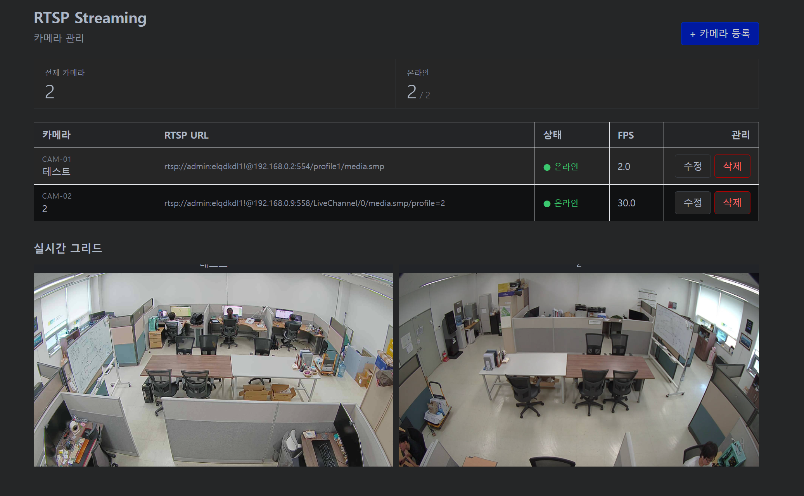

# rtsp-streaming



RTSP 카메라를 등록·수정·삭제하고, MediaMTX가 모든 코덱(H.264/H.265/MJPEG 등)을 H.264로 transcode해 브라우저에 WebRTC(WHEP)로 실시간 스트리밍하는 자기완결 모듈. NxN 자동 그리드(1줄 최대 4칸) 동시뷰 포함. 백엔드(FastAPI)는 카메라 CRUD + MediaMTX 제어만 담당 — 영상 디코딩은 안 거쳐 부하가 가볍다.

---

# 로컬 실행

backend(FastAPI) + frontend(React/Vite)를 직접 구동.

```bash
# 1. clone
git clone <repo-URL> rtsp-streaming
cd rtsp-streaming

# 2. 환경변수 (backend가 .env 읽음)
cp backend/.env.example backend/.env

# 3. 백엔드 (venv + alembic 스키마 + uvicorn)
cd backend
python3 -m venv .venv
.venv/bin/pip install -r requirements.txt
.venv/bin/alembic upgrade head
.venv/bin/uvicorn app.main:app --host 0.0.0.0 --port 8004

# 4. 프론트엔드 (새 터미널)
cd ../frontend
npm install
VITE_API_PORT=8004 VITE_MEDIAMTX_WEBRTC_PORT=8893 npm run dev -- --port 5177
```

> 영상 재생·카메라 등록은 MediaMTX가 떠 있어야 동작(브라우저가 MediaMTX에 직접 붙고, 등록도 MediaMTX 성공 확인 후 커밋). 전체 스택은 Docker 권장.

---

# Docker (전체 스택)

backend + frontend + MediaMTX 3컨테이너를 한 번에 기동.

```bash
# 1. clone
git clone <repo-URL> rtsp-streaming
cd rtsp-streaming

# 2. 포트 설정 (compose가 .env 읽음 — placeholder라 값 채워야 함)
cp .env.example .env
#   .env 편집: PORT_OFFSET / BACKEND_PORT / FRONTEND_PORT / MEDIAMTX_*_PORT / MEDIAMTX_WEBRTC_HOST

# 3. 빌드 + 기동
docker compose up -d --build
# → frontend http://localhost:5177 · backend :8004 · MediaMTX WHEP :8893
```

종료: `docker compose down`

> 외부에서 영상이 안 뜨면 `.env`의 `MEDIAMTX_WEBRTC_HOST`에 브라우저가 닿을 IP를 넣어라(LAN·공인, 쉼표구분). 미설정 시 MediaMTX가 컨테이너 내부 IP만 광고해 WebRTC 연결 실패.

---

## 포트

| 서비스 | 포트 |
|---|---|
| Frontend | 5177 |
| Backend (FastAPI) | 8004 |
| MediaMTX WebRTC / ICE(udp) | 8893 / 8193 |
| MediaMTX API / RTSP | 10001(loopback) / 8558 |

외부 접속 시 방화벽·포트포워딩 **4개** 필요(MediaMTX API·RTSP는 내부용 — 열 필요 없음):

```bash
sudo ufw allow 5177/tcp    # frontend
sudo ufw allow 8004/tcp    # backend
sudo ufw allow 8893/tcp    # MediaMTX WebRTC (영상)
sudo ufw allow 8193/udp    # MediaMTX ICE (udp 주의)
```

> 인증 없음 — `:8004`에 닿는 누구나 CRUD 가능. rtsp 비밀번호는 응답에서 `***`로 마스킹된다. 공개 배포 시 리버스 프록시/인증 뒤에 둘 것.
